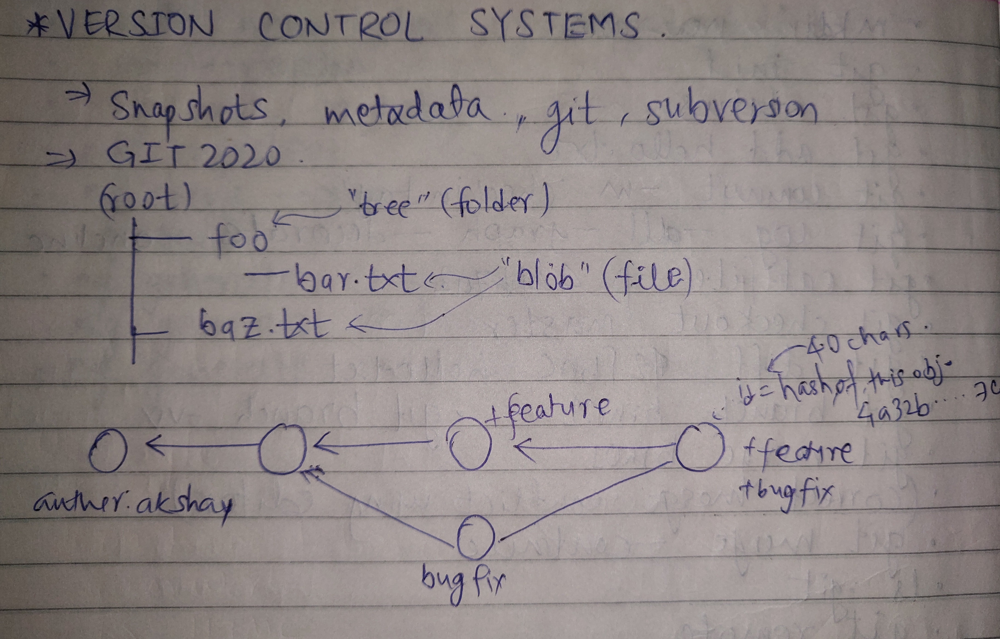

[](https://github.com/akshaychaudhari/cheatsheets-notes/blob/master/LICENSE)

<p align="center">
  
</p>

## Version Control System - GIT
<p align="center">
  
</p>

## Basic entities in git:
1. type blob = array<byte>
2. type tree = map<String,tree/blob>
3. type commit = struct{
				parent: array<commit>,
				author:String,
				message:String,
				snapshot: tree
				}
4. type object = blob | tree | commit

		```
		objects = map<String,object>

		def Store(1):
			id = sha1(1)
			object[id]=1

		def load(id):
			return object[id]
		```

## Important commands in git CLI.

* To intialise a directory as git repository:
	```
	mkdir new_repo
	cd new_repo
	git init .
	```
* Check status
	```
	git status
	```
	
* Adding the files to staging area.
	```
	git add hello.txt
	```

* Removing the files to staging area.
	```
	git reset
	```
	
* Commiting the staged code to git.	
	```
	git commit -m "checkin-tag"
	```
	
* Checking the log beautifully
	```
	git log --all --graph --decorate --oneline
	```
		
* To get content or type and size information for repository objects.
	```
	git cat-file -p 4365fa2
	```
	
* Download the master branch
	```
	git checkout master
	```	

* Check the diff.
	```
	git diff 4365fa2 master
	```
	
* Create branch.
	```
	git branch brn01
	git branch -vv
	```	

* To merge the brn01 with  header branch.
	```
	git merge brn01
	```
	
* Then solve the merge conflict using editor.
	```
	git merge --continue
	```

* .git directory content
	```
	ls .git 
	```

* Configuring remote
	```
	git remote
	git remote add <name> <url>
	```

* Uploading to remote
	```
	git push <remote>  <local branch>:<remote branch>
	git push -u origin master
	```

* Setting up the upload (remote) branch
	```
	git branch --set-upstream-to=origin/<branch> master
	```

* Cloning to local
	```
	git clone <url>
	```

* To fetch the content from remote repository.
	```
	git fetch
	```

* pull = fetch + merge
	```
	git pull
	git pull origin master
	```

*  To show the different objects. Here, we can see the last commit ka diff.
	```
	git show
	```

* To save the current working changes to staging and get back to HEAD as well.
	```
	git stash
	git stash pop
	```

* Use binary search to find the commit that introduced a bug.
	```
	git bisect
	```

* Adding gitignore file that list which files to not include in version control.
	```
	touch .gitignore
	```

* Difftool to check the difference.
	```
	git difftool
	```


* To beat the mismatch histories conflict while pulling/merging:
	```
	git pull origin master --allow-unrelated-histories
	```
* Github is a host for git repositories.